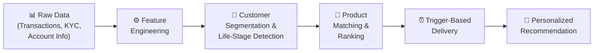
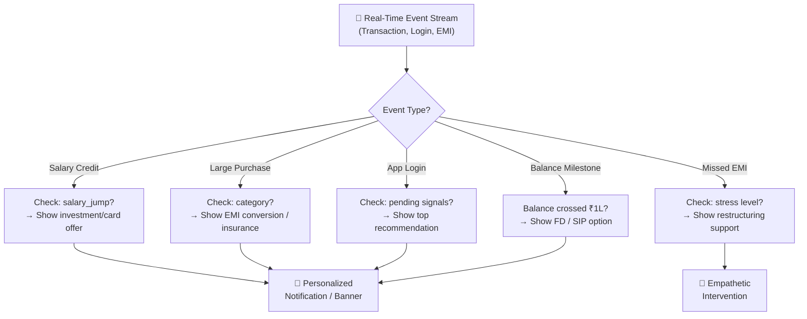
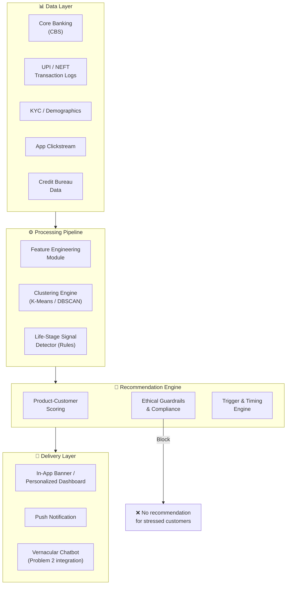

# Problem 1: Proactive Banking Product Recommendation Engine

## Problem Statement Recap

> Analyze a customer's **transaction history**, **spending patterns**, and **life-stage signals** (salary credits, EMI patterns, savings behavior, etc.) to **proactively recommend the most relevant banking product** (loan, insurance, investment, credit card) at the **right moment** — instead of generic pop-up offers.

---

## High-Level Approach: Multi-Signal Contextual Recommendation Engine

The core idea is a **three-stage pipeline**: **Feature Engineering → Customer Segmentation → Contextual Product Matching with Trigger-Based Timing**.



---

## Stage 1: Feature Engineering (Data → Signals)

### What data do we use?

| Data Source | Example Fields | What It Tells Us |
|---|---|---|
| **Salary Credits** | Amount, frequency, employer | Income level, stability, growth |
| **UPI/NEFT Transactions** | Merchant categories, frequency, amounts | Spending patterns, lifestyle |
| **EMI Outflows** | Recurring debits, loan types | Existing debt burden |
| **Savings Behavior** | Avg balance, FD/RD patterns, balance trends | Financial discipline, surplus |
| **Credit Card Usage** | Spend categories, utilization ratio | Creditworthiness, aspirations |
| **KYC/Demographics** | Age, location, occupation, family status | Life stage context |
| **App Behavior** | Pages visited, products explored, time spent | Intent signals |

### Derived Features (The Secret Sauce)

These are the **engineered features** that make the algorithm smart:

```
┌─────────────────────────────────────────────────────────────────┐
│  FINANCIAL HEALTH FEATURES                                      │
│  ─────────────────────────                                      │
│  • disposable_income = avg_salary - avg_emi - avg_recurring     │
│  • savings_ratio = avg_savings / avg_salary                     │
│  • debt_to_income = total_emi / avg_salary                      │
│  • balance_volatility = std_dev(daily_balance) / mean_balance   │
│  • salary_growth_rate = (latest_salary - salary_6mo_ago) / ...  │
│                                                                 │
│  SPENDING PATTERN FEATURES                                      │
│  ─────────────────────────                                      │
│  • category_spend_vector = [food%, travel%, shopping%, ...]     │
│  • avg_transaction_size per category                            │
│  • weekend_vs_weekday_spend_ratio                               │
│  • luxury_spend_ratio = luxury_txns / total_txns                │
│  • recurring_subscription_count                                 │
│                                                                 │
│  LIFE-STAGE SIGNALS                                             │
│  ─────────────────────────                                      │
│  • recent_large_deposits (wedding gift? bonus?)                 │
│  • education_spend_spike (school/college fees detected)         │
│  • rent_payment_pattern (renting vs. no rent = owns home?)      │
│  • medical_spend_increase (health insurance need?)              │
│  • travel_frequency_change (lifestyle upgrade?)                 │
│  • new_emi_start (just took a loan? cross-sell insurance)       │
└─────────────────────────────────────────────────────────────────┘
```

---

## Stage 2: Customer Segmentation & Life-Stage Detection

### Algorithm: Hybrid Clustering + Rule-Based Life-Stage

We use a **two-layer approach**:

### Layer A — Unsupervised Clustering (K-Means / DBSCAN)

Cluster customers into behavioral segments using the engineered features:

```
Algorithm: K-Means with Silhouette Score optimization
─────────────────────────────────────────────────────
Input:  Feature matrix X (n_customers × m_features)
        - Normalize all features using StandardScaler
        - Apply PCA if dimensionality > 15 (retain 95% variance)

Steps:
  1. Run K-Means for k = 3 to 12
  2. Compute silhouette_score(X, labels) for each k
  3. Pick k* = argmax(silhouette_score)
  4. Final clustering with k*

Output: Cluster labels + centroids
```

**Expected Clusters (illustrative):**

| Cluster | Profile | Characteristics |
|---|---|---|
| 🟢 **Young Earners** | Age 22-28, first job | Low savings, high UPI, no EMIs |
| 🔵 **Stable Professionals** | Age 28-40, growing salary | Moderate savings, some EMIs, investment-ready |
| 🟡 **Family Builders** | Age 30-45, school fees detected | High expenses, insurance needs, home loan potential |
| 🟠 **High Networth** | High salary, luxury spend | Low debt, premium product appetite |
| 🔴 **Financially Stressed** | Declining balance, missed EMIs | Need support, NOT upselling |

### Layer B — Rule-Based Life-Stage Detection (Event Triggers)

This layer catches **temporal life events** that clustering alone misses:

```python
# Pseudocode for Life-Stage Signal Detection

def detect_life_stage_signals(customer):
    signals = []

    # 1. SALARY JUMP → Promotion/New Job
    if salary_growth_3months(customer) > 30%:
        signals.append("SALARY_JUMP")
        # → Recommend: Premium credit card, Investment SIP, Tax-saving FD

    # 2. FIRST SALARY CREDIT → New Earner
    if is_first_salary_ever(customer):
        signals.append("NEW_EARNER")
        # → Recommend: Zero-balance savings, Basic insurance, Starter SIP

    # 3. LARGE RECURRING EDUCATION PAYMENTS
    if detect_education_payments(customer) > threshold:
        signals.append("EDUCATION_EXPENSE")
        # → Recommend: Education loan, Child insurance plan

    # 4. RENT PAYMENTS DETECTED + NO HOME LOAN
    if has_rent_payments(customer) and not has_home_loan(customer):
        signals.append("POTENTIAL_HOME_BUYER")
        # → Recommend: Home loan pre-approval, Home insurance

    # 5. MEDICAL EXPENSE SPIKE
    if medical_spend_increase(customer, window=3_months) > 50%:
        signals.append("HEALTH_CONCERN")
        # → Recommend: Health insurance (NOT a loan!)

    # 6. WEDDING SIGNALS (large jewelry/venue/catering txns)
    if detect_wedding_pattern(customer):
        signals.append("WEDDING_PLANNING")
        # → Recommend: Personal loan, Gold loan, Wedding insurance

    # 7. NEW VEHICLE PURCHASE (RTO/insurance/fuel txns)
    if detect_vehicle_purchase(customer):
        signals.append("VEHICLE_PURCHASE")
        # → Recommend: Vehicle insurance, Fuel credit card

    # 8. FINANCIALLY STRESSED (declining balance + missed EMI)
    if balance_trend(customer) == "declining" and missed_emi_count(customer) > 0:
        signals.append("FINANCIAL_STRESS")
        # → DO NOT recommend products. Trigger empathetic intervention.

    return signals
```

> [!CAUTION]
> **Ethical Guardrail**: If `FINANCIAL_STRESS` is detected, the system must **NOT** recommend loans or credit products. Instead, it should trigger supportive interventions (EMI restructuring, financial counseling). This is critical for the judging criteria around "genuine customer benefit."

---

## Stage 3: Product Matching & Ranking

### Algorithm: Weighted Multi-Factor Scoring

For each customer, score every candidate product using a **weighted formula**:

```
Product_Score(customer, product) = 
      w₁ × Relevance(cluster, product)
    + w₂ × LifeStage_Match(signals, product)
    + w₃ × Financial_Fit(customer_finances, product)
    + w₄ × Timing_Score(recency_of_trigger)
    + w₅ × Intent_Score(app_behavior)
    - penalty × Ethical_Risk(customer_stress, product_type)
```

### Scoring Breakdown

#### 1. Relevance Score (Cluster → Product Affinity Matrix)

Pre-computed from historical data or domain expertise:

```
                    Personal  Home   Credit  Health   SIP    FD
                     Loan     Loan   Card    Insur.  Invest  
Young Earners        0.3      0.1    0.8     0.4     0.6    0.2
Stable Prof.         0.5      0.7    0.6     0.5     0.9    0.5
Family Builders      0.6      0.8    0.4     0.9     0.7    0.6
High Networth        0.2      0.3    0.9     0.3     0.8    0.7
Fin. Stressed        0.0      0.0    0.0     0.2     0.0    0.1
```

#### 2. Financial Fit Score

```python
def financial_fit(customer, product):
    if product.type == "LOAN":
        # Can they afford it? DTI should stay < 50%
        new_dti = (customer.total_emi + product.est_emi) / customer.salary
        return max(0, 1 - (new_dti / 0.5))  # 0 if DTI would exceed 50%

    elif product.type == "INVESTMENT":
        # Do they have surplus?
        return min(1.0, customer.disposable_income / product.min_investment)

    elif product.type == "INSURANCE":
        # Are they under-insured?
        coverage_gap = ideal_coverage(customer) - customer.existing_coverage
        return min(1.0, coverage_gap / ideal_coverage(customer))

    elif product.type == "CREDIT_CARD":
        # Match spend level to card tier
        return spend_tier_match(customer.monthly_spend, product.target_spend_range)
```

#### 3. Timing Score (Trigger Recency)

```
timing_score = exp(-λ × days_since_trigger)
```
- Recent triggers (e.g., salary jump yesterday) get high scores
- Old triggers decay exponentially (λ ≈ 0.05, so ~50% decay in 14 days)

#### 4. Intent Score (from app behavior)

```python
def intent_score(customer, product):
    # Did they browse this product category recently?
    page_visits = get_product_page_visits(customer, product.category, days=30)
    search_queries = get_search_queries(customer, product.keywords, days=30)
    return normalize(0.6 * page_visits + 0.4 * search_queries)
```

### Final Ranking

```python
def get_top_recommendations(customer, all_products, top_k=3):
    scores = []
    for product in all_products:
        score = (
            0.25 * relevance(customer.cluster, product)
          + 0.30 * life_stage_match(customer.signals, product)
          + 0.20 * financial_fit(customer, product)
          + 0.15 * timing_score(customer, product)
          + 0.10 * intent_score(customer, product)
          - 1.0  * ethical_penalty(customer, product)  # Hard penalty
        )
        scores.append((product, score))
    
    # Sort descending, return top-k with score > threshold
    scores.sort(key=lambda x: x[1], reverse=True)
    return [(p, s) for p, s in scores[:top_k] if s > MIN_SCORE_THRESHOLD]
```

---

## Stage 4: Trigger-Based Delivery (Right Moment)

Instead of showing recommendations randomly, deliver them at **contextually appropriate moments**:



### Trigger Rules (Examples)

| Trigger Event | Condition | Recommendation | Channel |
|---|---|---|---|
| Salary credited | salary > prev_salary × 1.2 | Premium card upgrade | In-app banner |
| Salary credited | savings_ratio > 0.3 | SIP / Mutual fund | Push notification |
| School fee paid | education_txn detected | Education loan / Child plan | In-app card |
| Rent paid | rent > 30% of salary | Home loan pre-approval | Personalized email |
| Medical bill | large hospital payment | Health insurance | In-app nudge |
| App login | high-intent user (browsed loans) | Pre-approved loan offer | In-app modal |
| 3 months no activity | dormant user with balance | FD / Savings offer | SMS + push |

---

## Complete Architecture Diagram



---

## Algorithm Complexity & Efficiency

| Component | Time Complexity | Frequency |
|---|---|---|
| Feature Engineering | O(T) per customer (T = transactions) | Batch: Daily |
| K-Means Clustering | O(n × k × d × i) | Batch: Weekly |
| Life-Stage Detection | O(T) per customer | Real-time per event |
| Product Scoring | O(P) per customer (P = products) | Real-time per trigger |
| Top-K Selection | O(P log K) | Real-time per trigger |

**Overall**: The system runs **batch processing daily/weekly** for clustering and features, but **real-time scoring** when triggers fire. This makes it both efficient and responsive.

---

## Ethical Safeguards (Critical for Judging)

> [!IMPORTANT]
> The judges specifically call out: *"genuine customer benefit, not just upsell-driven"* and *"not over-recommending loans to financially stressed customers"*

### Built-In Safeguards

1. **Financial Stress Detection** → Block all loan/credit recommendations
2. **Debt-to-Income Cap** → Never recommend a loan that pushes DTI > 50%
3. **Recommendation Fatigue Limit** → Max 1 recommendation per week per channel
4. **Explainability** → Every recommendation comes with a human-readable reason:
   - *"Based on your growing salary, a SIP of ₹5,000/month could grow to ₹X in 5 years"*
5. **Opt-Out** → User can dismiss or turn off personalized offers
6. **DPDP Act Compliance** → Consent-based data usage, data localization within India
7. **Bias Auditing** → Regular checks that the algorithm doesn't discriminate by gender, caste, religion, or geography

---

## Why This Approach Wins

| Judging Criteria | How We Address It |
|---|---|
| **Innovation & Technical Feasibility** | Hybrid ML + Rules approach, works with existing bank data |
| **Depth of Personalization** | Multi-signal scoring, not just demographics |
| **Genuine Customer Benefit** | Financial stress detection blocks predatory upselling |
| **Explainability & RBI Compliance** | Rule-based triggers + human-readable explanations |
| **Usability for Non-Tech Users** | Recommendations with plain-language reasons |
| **Scalability** | Batch features + real-time scoring = handles millions |

---

## Summary: The Algorithm in One Sentence

> **Cluster customers by financial behavior, detect real-time life events from transactions, score each banking product using a weighted multi-factor formula (relevance + financial fit + timing + intent − ethical risk), and deliver the top recommendation at the contextually right moment — while actively protecting financially stressed users from predatory offers.**
